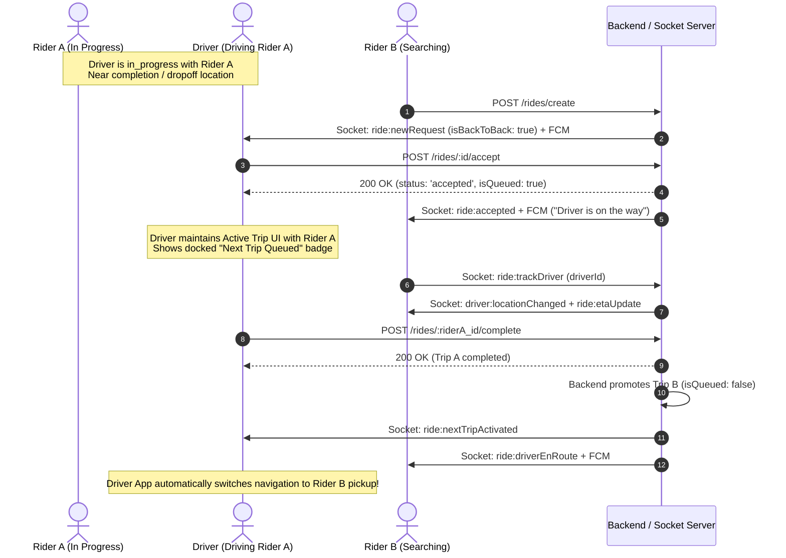

This document details the complete client-side integration requirements for the **Driver App** and **User (Rider) App** for the Back-to-Back Ride Dispatch system.

---

## 1. System Architecture & Lifecycle



---

## 2. API Endpoints Reference

### 2.1 Driver App Endpoints

#### A. Accept Queued / Back-to-Back Ride
When a driver is currently in an active ride (`in_progress`) and accepts a incoming B2B request.

- **Method**: `POST`
- **URL**: `/api/v1/rides/:id/accept`
- **Headers**:
  ```http
  Authorization: Bearer <driver_jwt_token>
  Content-Type: application/json
  ```
- **Request Body**: `{}` (Empty JSON object)
- **Success Response (`200 OK`)**:
  ```json
  {
    "success": true,
    "statusCode": 200,
    "message": "Ride accepted successfully",
    "data": {
      "_id": "6741b2c45e8a1f2b3c4d5e6f",
      "user": {
        "_id": "6741a0e1234567890abcdef1",
        "name": "Sarah Connor",
        "phone": "+447911123456",
        "profilePicture": "https://res.cloudinary.com/mktours/image/upload/v1/users/sarah.jpg"
      },
      "driver": "673f9b112233445566778899",
      "status": "accepted",
      "isQueued": true,
      "previousRide": "6740f9988776655443322110",
      "pickupLocation": {
        "address": "45 Piccadilly, London W1J 0ER",
        "coordinates": [-0.1388, 51.5074]
      },
      "dropoffLocation": {
        "address": "Baker Street Station, London NW1 6XE",
        "coordinates": [-0.1569, 51.5237]
      },
      "stops": [],
      "vehicleCategorySlug": "saloon",
      "fare": 18.50,
      "distance": 2.4,
      "paymentMethod": "stripe",
      "paymentStatus": "authorized",
      "acceptedAt": "2026-09-23T18:35:00.000Z"
    }
  }
  ```
- **Error Responses**:
  - `400 Bad Request`: `{"success": false, "message": "Ride is not available"}`
  - `400 Bad Request`: `{"success": false, "message": "Driver already has a queued ride"}`

---

#### B. Driver Cancels the Queued Ride
If the driver decides they cannot take the queued ride while still on Trip A.

- **Method**: `POST`
- **URL**: `/api/v1/rides/:id/cancel/driver`
- **Headers**:
  ```http
  Authorization: Bearer <driver_jwt_token>
  Content-Type: application/json
  ```
- **Request Body**:
  ```json
  {
    "reason": "Unable to reach pickup after current trip"
  }
  ```
- **Success Response (`200 OK`)**:
  ```json
  {
    "success": true,
    "statusCode": 200,
    "message": "Ride cancelled successfully",
    "data": {
      "_id": "6741b2c45e8a1f2b3c4d5e6f",
      "status": "cancelled",
      "cancelledBy": "driver",
      "cancellationReason": "Unable to reach pickup after current trip"
    }
  }
  ```

---

#### C. Driver Completes Current Ride (Triggers Promotion)
When driver finishes Trip A, Trip B is automatically promoted in the database.

- **Method**: `POST` or `PATCH`
- **URL**: `/api/v1/rides/:id/complete`
- **Headers**:
  ```http
  Authorization: Bearer <driver_jwt_token>
  Content-Type: application/json
  ```
- **Request Body**:
  ```json
  {
    "latitude": 51.5074,
    "longitude": -0.1388
  }
  ```
- **Success Response (`200 OK`)**:
  ```json
  {
    "success": true,
    "statusCode": 200,
    "message": "Ride completed successfully",
    "data": {
      "_id": "6740f9988776655443322110",
      "status": "completed",
      "fare": 22.00,
      "actualFare": 22.00,
      "hasQueuedRidePromoted": true,
      "nextRideId": "6741b2c45e8a1f2b3c4d5e6f"
    }
  }
  ```

---

### 2.2 User App Endpoints

#### A. User Cancels While Queued
If Rider B cancels before the driver arrives.

- **Method**: `POST`
- **URL**: `/api/v1/rides/:id/cancel/user`
- **Headers**:
  ```http
  Authorization: Bearer <user_jwt_token>
  Content-Type: application/json
  ```
- **Request Body**:
  ```json
  {
    "reason": "Wait time too long"
  }
  ```
- **Success Response (`200 OK`)**:
  ```json
  {
    "success": true,
    "statusCode": 200,
    "message": "Ride cancelled successfully",
    "data": {
      "_id": "6741b2c45e8a1f2b3c4d5e6f",
      "status": "cancelled",
      "cancelledBy": "user"
    }
  }
  ```

---

## 3. Socket.IO Events Reference

### 3.1 Driver App Socket Events

| Event Name | Direction | Timing / Trigger | Payload Description |
| :--- | :--- | :--- | :--- |
| `ride:newRequest` | Server -> Driver | Dispatched when a new ride matches driver's dropoff vicinity | Includes `isBackToBack: true` flag |
| `ride:accept` | Driver -> Server | Driver accepts ride via socket (optional alternate to REST) | `{ "rideId": "...", "userId": "..." }` |
| `ride:nextTripActivated` | Server -> Driver | Emitted right when Driver completes Trip A and Trip B becomes active | Next ride full details & pickup location |
| `ride:cancelled` | Server -> Driver | Emitted if Rider B cancels the queued ride while Driver is on Trip A | `{ "rideId": "...", "cancelledBy": "user" }` |
| `driver:locationUpdate` | Driver -> Server | Continuous GPS broadcast from driver app | `{ "latitude": 51.5..., "longitude": -0.1... }` |

#### Payload: `ride:newRequest` (Received by B2B Driver)
```json
{
  "rideId": "6741b2c45e8a1f2b3c4d5e6f",
  "pickupLocation": {
    "address": "45 Piccadilly, London W1J 0ER",
    "coordinates": [-0.1388, 51.5074]
  },
  "dropoffLocation": {
    "address": "Baker Street Station, London NW1 6XE",
    "coordinates": [-0.1569, 51.5237]
  },
  "stops": [],
  "fare": 18.50,
  "distance": 2.4,
  "vehicleCategorySlug": "saloon",
  "isCongestionCharge": false,
  "congestionChargeAmount": 0,
  "isBackToBack": true,
  "message": "New ride near your current dropoff",
  "user": {
    "name": "Sarah Connor"
  }
}
```

#### Payload: `ride:nextTripActivated` (Received by Driver upon Trip A Completion)
```json
{
  "rideId": "6741b2c45e8a1f2b3c4d5e6f",
  "pickupLocation": {
    "address": "45 Piccadilly, London W1J 0ER",
    "coordinates": [-0.1388, 51.5074]
  },
  "dropoffLocation": {
    "address": "Baker Street Station, London NW1 6XE",
    "coordinates": [-0.1569, 51.5237]
  },
  "fare": 18.50,
  "distance": 2.4,
  "stops": [],
  "vehicleCategorySlug": "saloon",
  "user": {
    "name": "Sarah Connor",
    "phone": "+447911123456",
    "profilePicture": "https://res.cloudinary.com/mktours/image/upload/v1/users/sarah.jpg"
  },
  "message": "Your next ride is ready! Head to the pickup location."
}
```

---

### 3.2 User (Rider) App Socket Events

| Event Name | Direction | Timing / Trigger | Payload Description |
| :--- | :--- | :--- | :--- |
| `ride:accepted` | Server -> User | Emitted when driver accepts (idle or B2B) | Complete driver profile & vehicle details |
| `ride:driverEnRoute` | Server -> User | Emitted when driver finishes Trip A and starts heading to Rider B | Status & notification message |
| `ride:etaUpdate` | Server -> User | Real-time ETA updates from server calculation | `{ "rideId": "...", "duration": "8 mins", "distance": "1.8 mi" }` |
| `driver:locationChanged` | Server -> User | Real-time driver coordinates for map tracking | `{ "driverId": "...", "location": { ... }, "etas": [...] }` |

#### Payload: `ride:accepted` (Received by Rider B)
```json
{
  "rideId": "6741b2c45e8a1f2b3c4d5e6f",
  "status": "accepted",
  "isScheduled": false,
  "scheduledPickupTime": null,
  "driver": {
    "id": "673f9b112233445566778899",
    "name": "Michael Schumacher",
    "phone": "+447822998877",
    "profilePicture": "https://res.cloudinary.com/mktours/image/upload/v1/drivers/michael.jpg",
    "rating": 4.95,
    "totalRides": 1420,
    "vehicle": {
      "categorySlug": "saloon",
      "model": "Toyota Prius 2022",
      "number": "LD22 XYZ",
      "color": "Silver Metallic"
    },
    "location": {
      "type": "Point",
      "coordinates": [-0.1412, 51.5033]
    }
  },
  "pickupLocation": {
    "address": "45 Piccadilly, London W1J 0ER",
    "coordinates": [-0.1388, 51.5074]
  },
  "dropoffLocation": {
    "address": "Baker Street Station, London NW1 6XE",
    "coordinates": [-0.1569, 51.5237]
  },
  "fare": 18.50,
  "distance": 2.4,
  "paymentMethod": "stripe",
  "paymentStatus": "authorized",
  "requiresPayment": false,
  "message": "Driver accepted! Michael Schumacher is on the way."
}
```

#### Payload: `ride:driverEnRoute` (Received by Rider B when Driver finishes Trip A)
```json
{
  "rideId": "6741b2c45e8a1f2b3c4d5e6f",
  "status": "accepted",
  "message": "Your driver is on the way!"
}
```

---

## 4. FCM Push Notifications Payloads

### 4.1 Driver App FCM Payloads

#### New Back-to-Back Request Push (Background Wakeup)
```json
{
  "notification": {
    "title": "🔄 New Ride Near Your Dropoff",
    "body": "A Saloon request is near your current dropoff. Tap to queue it."
  },
  "data": {
    "type": "ride_request",
    "rideId": "6741b2c45e8a1f2b3c4d5e6f",
    "fare": "18.50",
    "isBackToBack": "true"
  }
}
```

#### Queued Trip Cancelled by Rider Push
```json
{
  "notification": {
    "title": "Trip Update",
    "body": "Your queued ride was cancelled by the passenger."
  },
  "data": {
    "type": "queued_ride_cancelled",
    "rideId": "6741b2c45e8a1f2b3c4d5e6f"
  }
}
```

---

### 4.2 User App FCM Payloads

#### Driver Assigned Push
```json
{
  "notification": {
    "title": "✅ Driver Assigned",
    "body": "Driver accepted! Michael Schumacher is on the way."
  },
  "data": {
    "type": "ride_accepted",
    "rideId": "6741b2c45e8a1f2b3c4d5e6f",
    "requiresPayment": "false",
    "paymentMethod": "stripe"
  }
}
```

#### Driver Heading to Pickup Push
```json
{
  "notification": {
    "title": "🚗 Driver On The Way",
    "body": "Your driver is heading to your pickup location!"
  },
  "data": {
    "type": "ride_driver_en_route",
    "rideId": "6741b2c45e8a1f2b3c4d5e6f"
  }
}
```

---

## 5. Client Application Integration Logic & State Handling

### 5.1 Driver App State Machine

```
      [ ACTIVE TRIP ON SCREEN (Trip A) ]
                      |
        Incoming ride:newRequest (isBackToBack: true)
                      |
             Accept Request API
                      |
      [ ACTIVE TRIP (Trip A) ]  +  [ QUEUED TRIP (Trip B) ]
        (Active on screen)           (Docked bottom pill/card)
                      |
             Trip A Completes
                      |
      Trip A Summary / Rating Dialog
                      |
    Auto-Transition: Trip B becomes ACTIVE TRIP
```

1. **State Storage**:
   - Maintain two distinct trip variables in state:
     - `activeTrip`: Trip object currently being navigated (`status: 'in_progress' | 'at_stop'`).
     - `queuedTrip`: Trip object accepted in advance (`status: 'accepted'`, `isQueued: true`).
2. **UI Rules**:
   - **Do NOT** switch map polyline or destination to Trip B while Trip A is incomplete.
   - Show a pinned overlay banner at the top or bottom of the active ride screen:
     - Text: *"Next: Pickup at [Trip B Pickup Address]"*
     - Fare badge: *£18.50*
     - Cancel button (calls `POST /rides/:id/cancel/driver`).
   - The action buttons ("Arrived at Pickup", "Start Ride") must **only apply to `activeTrip`**.
3. **Transition to Next Ride**:
   - Upon receiving `ride:nextTripActivated` OR upon successful `200 OK` from `completeRide` where `hasQueuedRidePromoted == true`:
     - Dismiss Trip A UI.
     - Move `queuedTrip` into `activeTrip` and clear `queuedTrip`.
     - Recalculate route polyline to Trip B's pickup location.
     - Show standard "Navigate to Pickup" interface with the "I've Arrived" button.

---

### 5.2 User App (Rider B) State Machine

1. **Messaging & Transparency**:
   - User B sees the standard driver assignment experience.
   - UI shows: *"Michael Schumacher is on the way"* with driver details, car model, and live car marker on map.
   - Per product requirement: **Avoid negative/confusing phrasing** such as *"Driver is finishing another passenger's trip"*.
2. **ETA Updates**:
   - The socket `ride:etaUpdate` smoothly reflects the realistic ETA (which accounts for the driver completing the remaining leg and heading over).
3. **Driver En Route Trigger**:
   - When `ride:driverEnRoute` fires, User B app can play a gentle chime or update status text to: *"Driver is heading to your pickup location"*.
